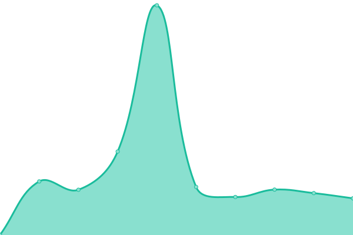
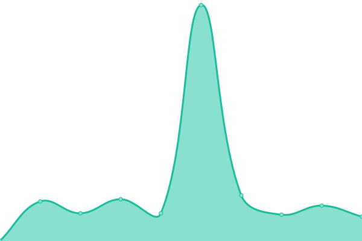

# [📈 Live Status](https://DfE-Digital.github.io/find-and-use-an-api-upptime): <!--live status--> **🟩 All systems operational**

This repository contains the open-source uptime monitor and status page for [Department for Education - Digital](http://education.gov.uk/), powered by [Upptime](https://github.com/upptime/upptime).

With [Upptime](https://upptime.js.org), you can get your own unlimited and free uptime monitor and status page, powered entirely by a GitHub repository. We use [Issues](https://github.com/DfE-Digital/find-and-use-an-api-upptime/issues) as incident reports, [Actions](https://github.com/DfE-Digital/find-and-use-an-api-upptime/actions) as uptime monitors, and [Pages](https://DfE-Digital.github.io/find-and-use-an-api-upptime) for the status page.

<!--start: status pages-->
<!-- This summary is generated by Upptime (https://github.com/upptime/upptime) -->
<!-- Do not edit this manually, your changes will be overwritten -->
<!-- prettier-ignore -->
| URL | Status | History | Response Time | Uptime |
| --- | ------ | ------- | ------------- | ------ |
|  [Consumption Portal - PROD](https://beta-find-and-use-an-api.education.gov.uk) | 🟩 Up | [consumption-portal-prod.yml](https://github.com/DFE-Digital/find-and-use-an-api-upptime/commits/HEAD/history/consumption-portal-prod.yml) | 

 619ms
     
 | 

<a href="https://DfE-Digital.github.io/find-and-use-an-api-upptime/history/consumption-portal-prod">100.00%</a>
    

|  [Management Portal - PROD](https://apimanagement.education.gov.uk) | 🟩 Up | [management-portal-prod.yml](https://github.com/DFE-Digital/find-and-use-an-api-upptime/commits/HEAD/history/management-portal-prod.yml) | 

 713ms
     
 | 

<a href="https://DfE-Digital.github.io/find-and-use-an-api-upptime/history/management-portal-prod">100.00%</a>
    

|  [Management API - PROD](https://apimanagement.education.gov.uk/api/tasks/apis) | 🟩 Up | [management-api-prod.yml](https://github.com/DFE-Digital/find-and-use-an-api-upptime/commits/HEAD/history/management-api-prod.yml) | 

 157ms
     
 | 

<a href="https://DfE-Digital.github.io/find-and-use-an-api-upptime/history/management-api-prod">100.00%</a>
    

|  [Demo Workspace API - PROD](https://api.education.gov.uk/example/getInformation) | 🟩 Up | [demo-workspace-api-prod.yml](https://github.com/DFE-Digital/find-and-use-an-api-upptime/commits/HEAD/history/demo-workspace-api-prod.yml) | 

 396ms
     
 | 

<a href="https://DfE-Digital.github.io/find-and-use-an-api-upptime/history/demo-workspace-api-prod">100.00%</a>
    

|  [Consumption Portal - PRE-PROD](https://pp-find-and-use-an-api.education.gov.uk) | 🟩 Up | [consumption-portal-pre-prod.yml](https://github.com/DFE-Digital/find-and-use-an-api-upptime/commits/HEAD/history/consumption-portal-pre-prod.yml) | 

 623ms
     
 | 

<a href="https://DfE-Digital.github.io/find-and-use-an-api-upptime/history/consumption-portal-pre-prod">100.00%</a>
    

|  [Management Portal - PRE-PROD](https://pp-apimanagement.education.gov.uk) | 🟩 Up | [management-portal-pre-prod.yml](https://github.com/DFE-Digital/find-and-use-an-api-upptime/commits/HEAD/history/management-portal-pre-prod.yml) | 

 681ms
     
 | 

<a href="https://DfE-Digital.github.io/find-and-use-an-api-upptime/history/management-portal-pre-prod">100.00%</a>
    

|  [Management API - PRE-PROD](https://pp-apimanagement.education.gov.uk/api/tasks/apis) | 🟩 Up | [management-api-pre-prod.yml](https://github.com/DFE-Digital/find-and-use-an-api-upptime/commits/HEAD/history/management-api-pre-prod.yml) | 

 171ms
     
 | 

<a href="https://DfE-Digital.github.io/find-and-use-an-api-upptime/history/management-api-pre-prod">100.00%</a>
    

|  [Demo Workspace API - Pre-PROD](https://pp-api.education.gov.uk/example/getInformation) | 🟩 Up | [demo-workspace-api-pre-prod.yml](https://github.com/DFE-Digital/find-and-use-an-api-upptime/commits/HEAD/history/demo-workspace-api-pre-prod.yml) | 

 441ms
     
 | 

<a href="https://DfE-Digital.github.io/find-and-use-an-api-upptime/history/demo-workspace-api-pre-prod">100.00%</a>
    

|  [Consumption Portal - TEST](https://test-find-and-use-an-api.education.gov.uk) | 🟩 Up | [consumption-portal-test.yml](https://github.com/DFE-Digital/find-and-use-an-api-upptime/commits/HEAD/history/consumption-portal-test.yml) | 

 611ms
     
 | 

<a href="https://DfE-Digital.github.io/find-and-use-an-api-upptime/history/consumption-portal-test">100.00%</a>
    

|  [Management Portal - TEST](https://test-apimanagement.education.gov.uk) | 🟩 Up | [management-portal-test.yml](https://github.com/DFE-Digital/find-and-use-an-api-upptime/commits/HEAD/history/management-portal-test.yml) | 

 618ms
     
 | 

<a href="https://DfE-Digital.github.io/find-and-use-an-api-upptime/history/management-portal-test">100.00%</a>
    

|  [Management API - TEST](https://test-apimanagement.education.gov.uk/api/tasks/apis) | 🟩 Up | [management-api-test.yml](https://github.com/DFE-Digital/find-and-use-an-api-upptime/commits/HEAD/history/management-api-test.yml) | 

 159ms
     
 | 

<a href="https://DfE-Digital.github.io/find-and-use-an-api-upptime/history/management-api-test">100.00%</a>
    

|  [Demo Workspace API - TEST](https://test-api.education.gov.uk/example/getInformation) | 🟩 Up | [demo-workspace-api-test.yml](https://github.com/DFE-Digital/find-and-use-an-api-upptime/commits/HEAD/history/demo-workspace-api-test.yml) | 

 394ms
     
 | 

<a href="https://DfE-Digital.github.io/find-and-use-an-api-upptime/history/demo-workspace-api-test">100.00%</a>
    

|  [Consumption Portal - DEV](https://dev-find-and-use-an-api.education.gov.uk) | 🟩 Up | [consumption-portal-dev.yml](https://github.com/DFE-Digital/find-and-use-an-api-upptime/commits/HEAD/history/consumption-portal-dev.yml) | 

 614ms
     
 | 

<a href="https://DfE-Digital.github.io/find-and-use-an-api-upptime/history/consumption-portal-dev">100.00%</a>
    

|  [Management Portal - DEV](https://dev-apimanagement.education.gov.uk) | 🟩 Up | [management-portal-dev.yml](https://github.com/DFE-Digital/find-and-use-an-api-upptime/commits/HEAD/history/management-portal-dev.yml) | 

 629ms
     
 | 

<a href="https://DfE-Digital.github.io/find-and-use-an-api-upptime/history/management-portal-dev">100.00%</a>
    

|  [Management API - DEV](https://dev-apimanagement.education.gov.uk/api/tasks/apis) | 🟩 Up | [management-api-dev.yml](https://github.com/DFE-Digital/find-and-use-an-api-upptime/commits/HEAD/history/management-api-dev.yml) | 

 147ms
     
 | 

<a href="https://DfE-Digital.github.io/find-and-use-an-api-upptime/history/management-api-dev">100.00%</a>
    

|  [Demo Workspace API - DEV](https://dev-api.education.gov.uk/example/getInformation) | 🟩 Up | [demo-workspace-api-dev.yml](https://github.com/DFE-Digital/find-and-use-an-api-upptime/commits/HEAD/history/demo-workspace-api-dev.yml) | 

 542ms
     
 | 

<a href="https://DfE-Digital.github.io/find-and-use-an-api-upptime/history/demo-workspace-api-dev">99.61%</a>
    

<!--end: status pages-->

[**Visit our status website →**](https://DfE-Digital.github.io/find-and-use-an-api-upptime)

## 📄 License

- Powered by: [Upptime](https://github.com/upptime/upptime)
- Code: [MIT](./LICENSE) © [Anand Chowdhary](https://anandchowdhary.com), supported by [Pabio](https://pabio.com)
- Data in the `./history` directory: [Open Database License](https://opendatacommons.org/licenses/odbl/1-0/)
